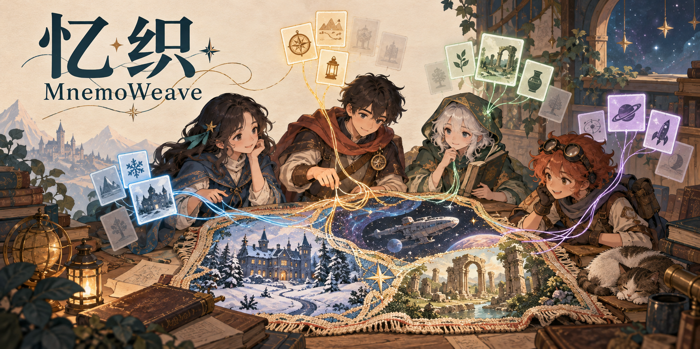

# MnemoWeave · 忆织平台

*Concept illustration, not an in-game screenshot.*

**Separate memories. A shared truth.**

[简体中文](README.md)

**A multi-scenario AI adventure platform where agents remember, forget, and collaborate.**

This project is a browser-based platform for AI adventures across authored scenarios. Characters experience events separately and organize or forget memories under limited capacity. Players coordinate tasks, communication, and memory retention so the team can continue working together. The Moonstone mystery is the first cooperative scenario; future scenarios may use other settings.

**Your teammates cannot remember everything. Decide who remembers what and when they remind each other, and help the team reach an ending.**

**Status: design and development preparation. This repository currently contains documentation; there is no runnable game yet.**

## The experience

- **Experience different events.** Assign tasks and bring separately acquired information together.
- **Coordinate retention.** Characters propose memory revisions; choose what to protect, discuss, or keep on a limited shared board.
- **Recover from forgetting.** Ask teammates, revisit sources, or pursue alternative evidence through routes and costs authored in advance.
- **Review information flow.** See who acquired, shared, compressed, or forgot information and what happened afterward. Separate director tools support branch comparisons.

The three investigators specialize in fieldwork, interviews, and records. They may use the same underlying model, but each receives only their own available memories and the messages actually delivered to them.

In cooperative scenarios, teammates share the objective but can still make mistakes or forget useful details. Later adversarial scenarios may give characters hidden objectives and allow withholding, misleading reports, and legal actions. They cannot rewrite world facts or delete another character's memory. Cooperative play here means one player working with AI teammates; it does not require multiplayer.

## Case 01: The Moonstone at Snowbound Manor

A blizzard closes the roads. A moonstone disappears from the manor's display cabinet without signs of forced entry. An access log provides the first lead. Find out who moved the object, recover it, and determine whether the move was authorized.

The case facts, timeline, and evidence are authored in advance. Agents generate their interpretations, conversations, and investigation proposals at runtime. The game does not invent new culprits or evidence during play to rewrite the solution.

## First release scope

| Area | Planned scope |
|---|---|
| Platform | Desktop web browser |
| Presentation | 2D map, portraits, evidence cards, event timeline |
| Content | One authored cooperative scenario, three AI teammates, five locations |
| Play and tools | Captain play and ending review; separate director tools for debugging and presentations |
| Basic prototype | Mask/restore a memory before the first briefing, legal recovery, and branch comparison |
| Core gameplay version | Memory capacity at phase boundaries, agent-proposed revisions, communication before forgetting, and protected memories; capacity values require playtesting |
| Duration targets | A 3–5 minute presentation and an estimated 8–12 minute full playthrough, both unmeasured |

The cooperative scenario comes first. Adversarial scenarios, other settings, procedural scenarios, voice interaction, 3D environments, multiplayer, and model training are later directions. Manual masking in the basic prototype is not an implemented automatic forgetting algorithm.

## Documentation

The detailed design documents are currently in Chinese.

| Document | Contents |
|---|---|
| [Game design](docs/game-design.md) | Player goals, roles, actions, action points, and interface |
| [Moonstone case specification](docs/cases/moonstone.md) | **Full spoilers:** world facts, evidence, actions, and resolution rules |
| [Memory and agent design](docs/memory-design.md) | Information access, communication, interventions, branching, and corrections |
| [Development roadmap](docs/roadmap.md) | Milestones, implementation tasks, and acceptance criteria |
| [Presentation guide](docs/demo-guide.md) | Live walkthrough, audience interaction, and recorded replay |
| [Cost estimate](docs/cost-estimate.md) | API usage assumptions, planning budget, and measurement |
| [Visual design](docs/visual-design.md) | Concept illustration, visual meaning, and generation prompt |

## Design principles

1. Case rules determine what happened in the world. Models interpret evidence, communicate, and propose actions.
2. Private memories are not automatically shared. An evidence identifier alone does not grant access to its contents.
3. Director-only information and complete logs do not automatically enter agent inputs.
4. Memory interventions are not scripted to cause failure. Agents may recover missing information.
5. Live inference and recorded replay are clearly labeled. Prewritten dialogue is not presented as live model output.
6. Acquisition, recovery, and alternative evidence routes are authored in advance. The game does not invent rescue clues or guarantee victory.
7. Adversarial play does not expose every private memory or hidden objective. Complete traces belong in ending reviews or separate director tools.

## Naming

| Use | Name |
|---|---|
| Chinese name | 忆织平台 |
| English brand | MnemoWeave |
| Full English name | MnemoWeave Platform |
| Repository | `mnemoweave` |
| Display name | 忆织 · MnemoWeave |

The Chinese name describes weaving individual memories into a shared story. Mnemo evokes memory, and Weave expresses how separate experiences come together.

GitHub repository description: **A multi-scenario AI adventure platform where agents remember, forget, and collaborate.**

Current descriptive subtitle: **A Multi-Scenario AI Adventure Platform Built Around Team Memory**.

Design updated: 2026-10-09.

## License

Unless otherwise noted, the contents of this repository are licensed under the [Apache License 2.0](LICENSE), which permits commercial use, modification, and distribution. Use and redistribution must comply with the license, preserve applicable copyright and attribution notices, and prominently identify modified files.

Project attribution is provided in [NOTICE](NOTICE). The license does not grant trademark rights to the project name or marks.
